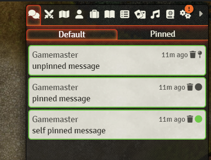
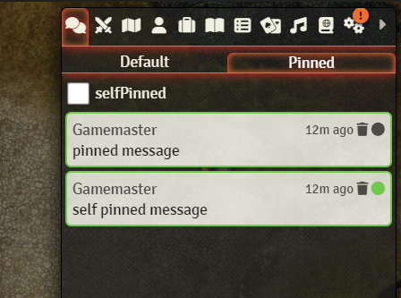
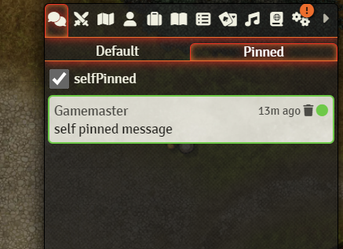

# foundryVTT-pinned-chatlog-module
Module for Foundry VTT. It add another chatlog for pinned message to pinned some chat message in another chatlog in foundry VTT



If you double click on a message pin, it s gonna pin the message only for you. The self pinned icon get the color of the user.
You can also pin through the righ click menu of the chat message.

In the pinned tab you can use a use the check box to show only the self pinned message





## Settings

### Allow player to update message
By default, you can only pinned message that you owned if you're are not GM. But it can be change in the settings

### Disable pinner for player
There is two settings to disable "pin for all" or/and "self pin". 
If one is disable, simple click and double click will do the same behaviour (the one not disable).
If both is disable, the pin button doesn't appears anymore.

## API
The expose 3 methods by api : game.modules.get('pinned-chat-message').api.methodXXX

### pinnedMessage
```game.modules.get('pinned-chat-message').api.pinnedMessage(inputChatMessage, userId)```
Pinned the input message.
The input message can be a chat message or his id and the id of the user for selfPinned

### unpinnedMessage
```game.modules.get('pinned-chat-message').api.pinnedMessage(unpinnedMessage, userId)```
Unpinned the input message.
The input message can be a chat message or his id and the id of the user for selfPinned

### togglePinnedMessage
```game.modules.get('pinned-chat-message').api.togglePinnedMessage(inputChatMessage, userId)```
Pinned an unpinned input message and unpinned a pinned input message.
The input message can be a chat message or his id and the id of the user for selfPinned
